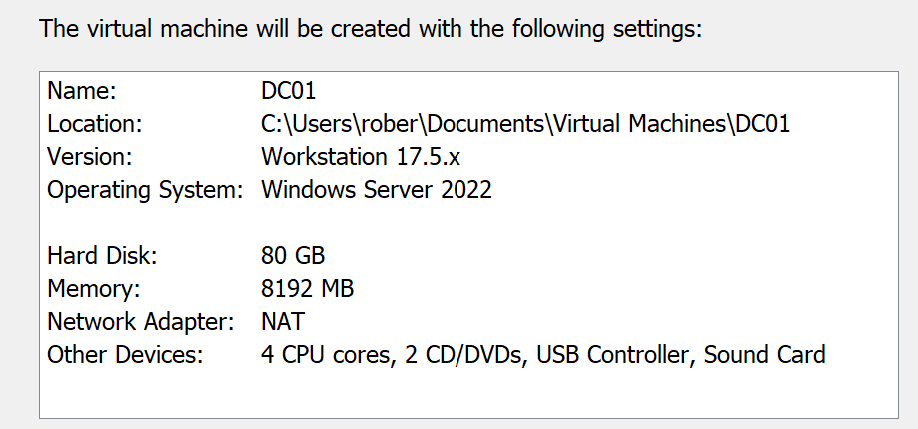
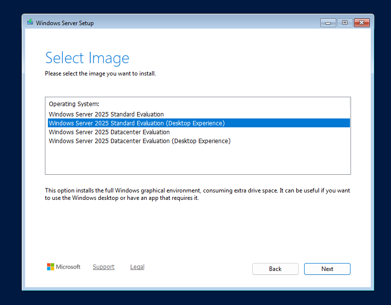
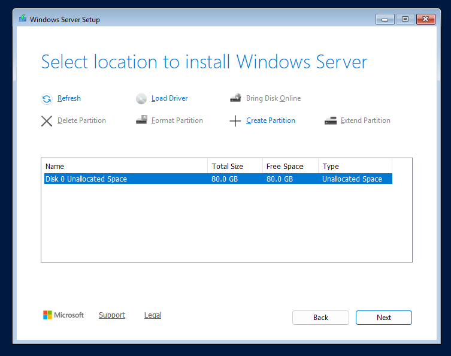
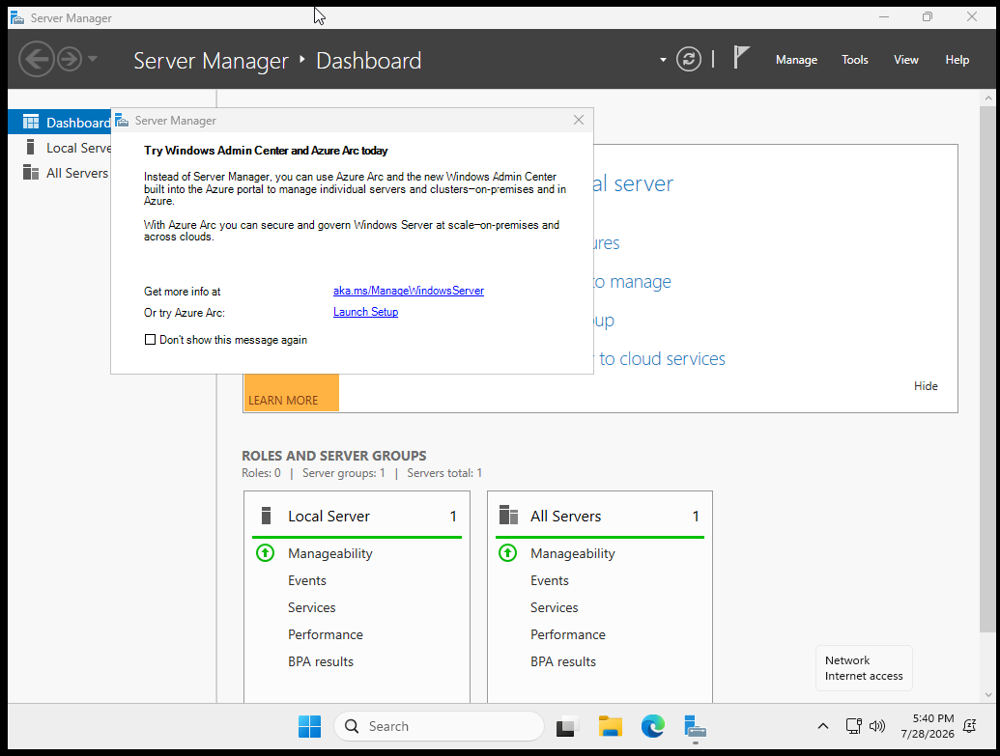

# Windows Server Installation

## Objective

Deploy Windows Server 2025 to serve as the first domain controller (DC01) for the Vig Tech Active Directory environment.

---

## Environment

| Component | Value |
|-----------|-------|
| Hypervisor | VMware Workstation 17.5.x |
| Guest OS | Windows Server 2025 |
| Compatibility | Windows Server 2022 |
| Memory | 8 GB |
| CPU | 4 vCPUs |
| Disk | 80 GB |
| Network | NAT |

---

## Installation Steps

### Step 1 - Virtual Machine Configuration

**Explanation**

The DC01 virtual machine was created with 4 vCPUs, 8 GB of memory, an 80 GB virtual disk, and NAT networking. These specifications provide sufficient resources for the planned Active Directory environment.

---

### Step 2 - Operating System Selection

**Explanation**

Windows Server 2025 Standard (Desktop Experience) was selected. The Desktop Experience edition includes a graphical user interface, making it easier to configure and document the environment while learning Windows Server administration.

---

### Step 3 - Disk Configuration

**Explanation**

The operating system was installed on the 80 GB virtual disk using the default partition layout. This provides adequate storage for the operating system and future Active Directory services.

---

### Step 4 - First Login

**Explanation**

After the installation completed, the server was accessed using the local **Administrator** account. Windows Server successfully loaded the desktop and automatically launched **Server Manager**, confirming that the operating system had been installed correctly and was ready for post-installation configuration.

---

## Validation

The installation was considered successful after verifying the following:

- The operating system booted successfully.
- Login using the local Administrator account was successful.
- Server Manager launched automatically.
- No installation errors were present.
  
---

## Enterprise Importance

Windows Server provides the foundation for centralized authentication, identity management, DNS, DHCP, and Group Policy within an enterprise environment. This server will later be promoted to the first domain controller for the `vigtech.local` domain.
