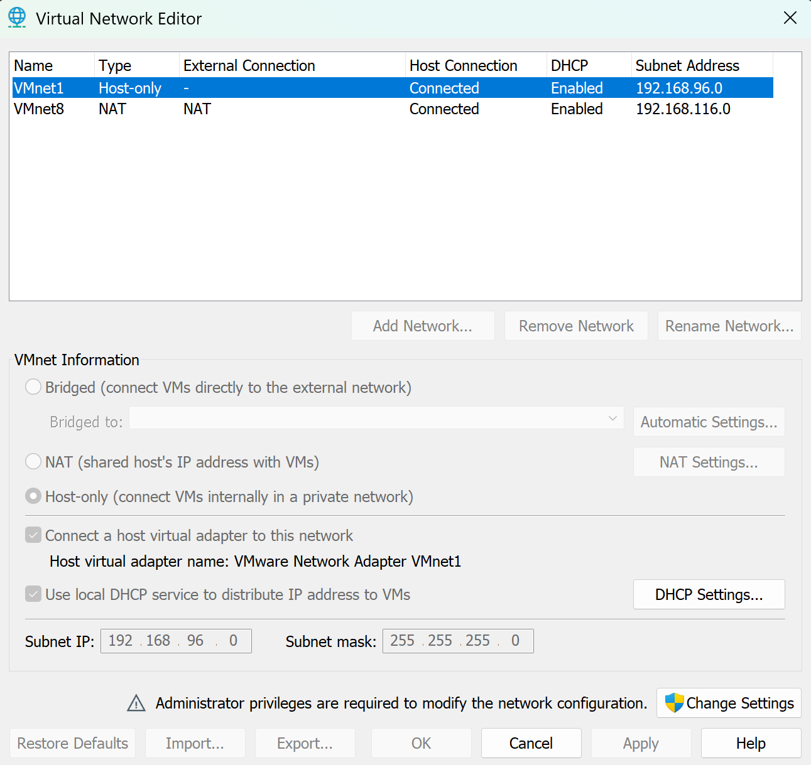
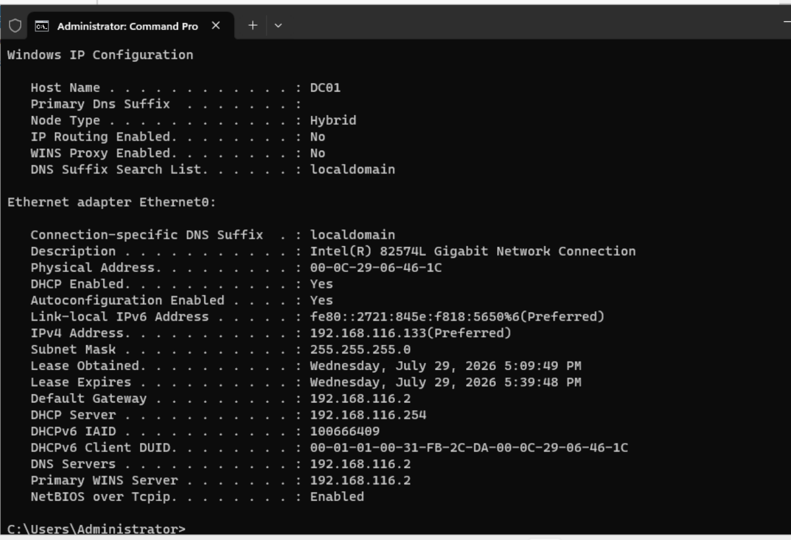
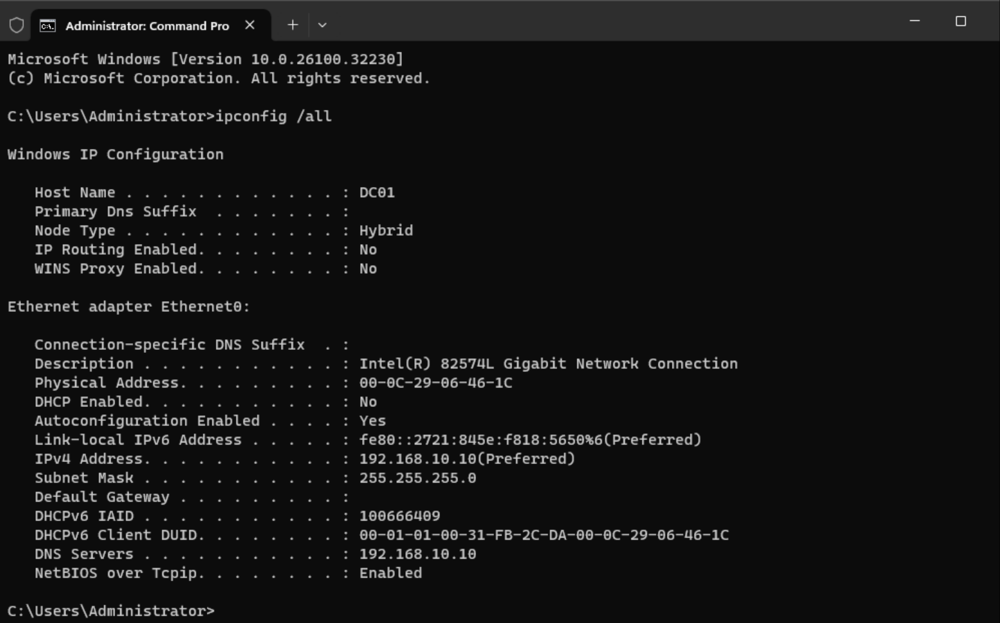

# Static IP Configuration

## Objective

Configure a static IPv4 address for the domain controller to ensure consistent network communication and reliable Active Directory services.

---

## Business Justification

Domain Controllers should always use static IP addresses. Active Directory relies heavily on DNS, and changing IP addresses can prevent domain clients from locating authentication and directory services.

---

## Environment

| Item | Value |
|------|-------|
| Server | DC01 |
| Operating System | Windows Server 2025 |
| Network Type | VMware Host-Only |
| IP Address | 192.168.10.10 |
| Subnet Mask | 255.255.255.0 |
| Preferred DNS | 192.168.10.10 |

---

## Procedure

1. Configured VMware Workstation to use a Host-Only virtual network.
2. Assigned a static IPv4 address to the server.
3. Configured the server to use itself as the preferred DNS server.
4. Disabled DHCP on the network adapter.

---

## Screenshots

### Host-Only Network Configuration

### Static IPv4 Configuration

### Validation

---

## Validation

The network configuration was verified using `ipconfig /all`.

Validation confirmed:

- Host name is **DC01**
- Static IP address is **192.168.10.10**
- DHCP is disabled
- Preferred DNS server is configured as **192.168.10.10**
- The server is operating on the Host-Only virtual network

---

## Enterprise Importance

Using static IP addressing for infrastructure servers is a standard enterprise practice. Consistent addressing simplifies administration, improves DNS reliability, and ensures Active Directory services remain available to domain-joined clients.
