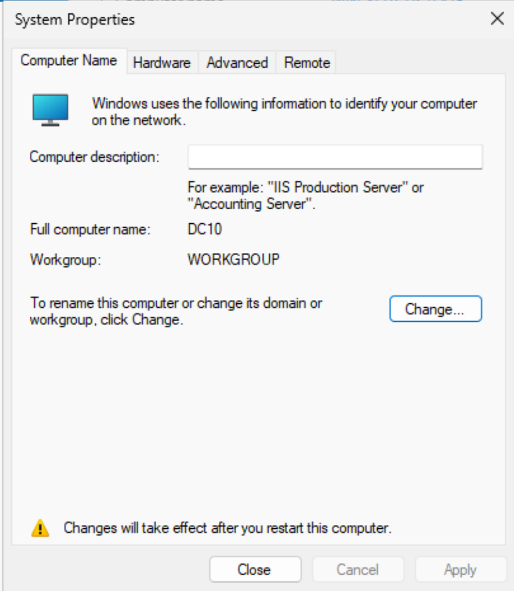

# Server Rename

## Objective

Rename the Windows Server to **DC01** before configuring Active Directory.

## Screenshot

## Validation

After restarting the server, the computer name was verified as **DC01** through **System Properties**.

## Enterprise Importance

Using standardized server names improves administration, documentation, monitoring, and troubleshooting. Naming the server **DC01** clearly identifies it as the first Domain Controller within the environment and follows common enterprise naming conventions.
