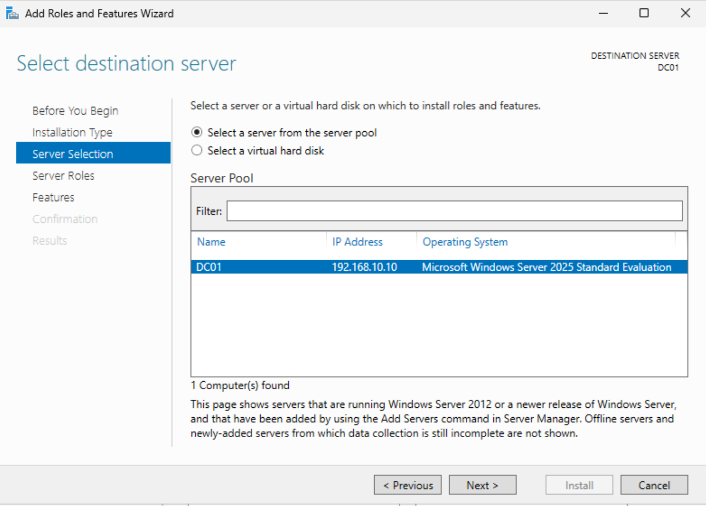
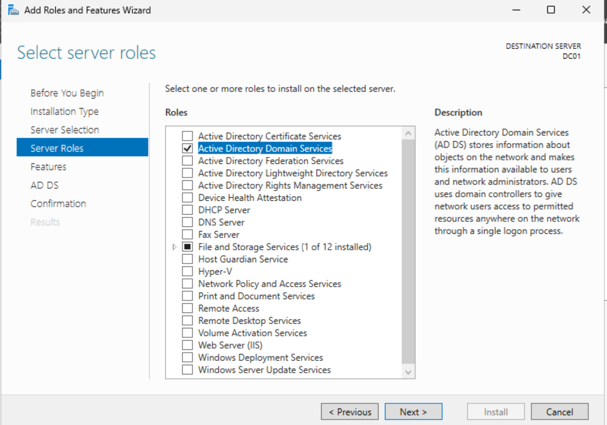
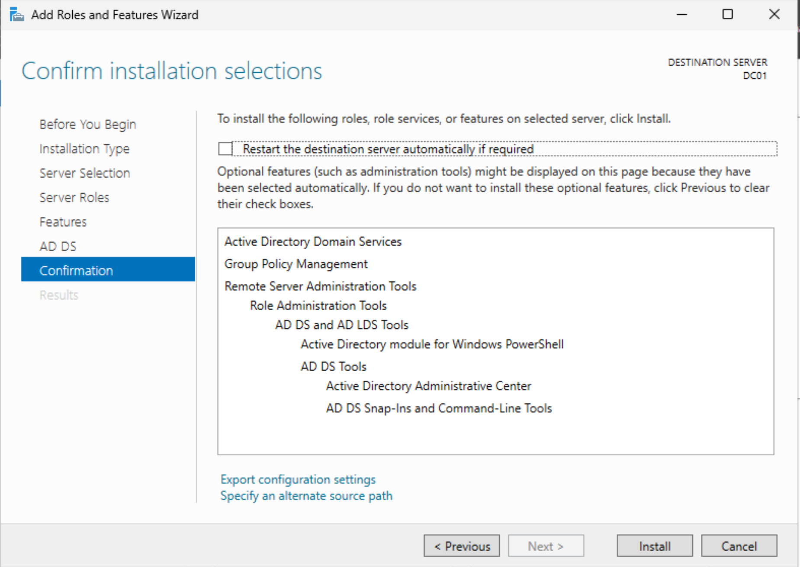

# Active Directory Domain Services (AD DS) Installation

## Objective

Install the Active Directory Domain Services (AD DS) role on the Windows Server 2025 virtual machine to prepare it for promotion as the organization's first Domain Controller.

---

## Business Justification

Active Directory Domain Services (AD DS) provides centralized identity and access management for Windows environments. Instead of maintaining user accounts and security policies on each individual computer, AD DS allows administrators to manage authentication, authorization, computers, groups, and organizational resources from a centralized directory.

Installing the AD DS role is the first step toward building a secure, scalable, and enterprise-ready infrastructure.

---

## Environment

| Component | Value |
|-----------|-------|
| Hypervisor | VMware Workstation Pro |
| Operating System | Windows Server 2025 |
| Server Name | DC01 |
| IP Address | 192.168.10.10 |
| Network | Host-Only (192.168.10.0/24) |

---

## Installation Procedure

1. Open **Server Manager**.
2. Navigate to **Manage > Add Roles and Features**.
3. Select **Role-based or feature-based installation**.
4. Choose the local server (**DC01**).
5. Select **Active Directory Domain Services**.
6. Accept the required management tools.
7. Leave all additional Features at their default values.
8. Review the installation summary.
9. Click **Install**.

---

## Validation

The Active Directory Domain Services role installed successfully without errors and the server became eligible for promotion to a Domain Controller.

---

## Screenshots

### Server Roles Selection

---

### Active Directory Role Selected

---

### Installation Confirmation

---

## Key Takeaways

- Installed the Active Directory Domain Services server role.
- Installed the required administrative management tools.
- Prepared DC01 for Domain Controller promotion.