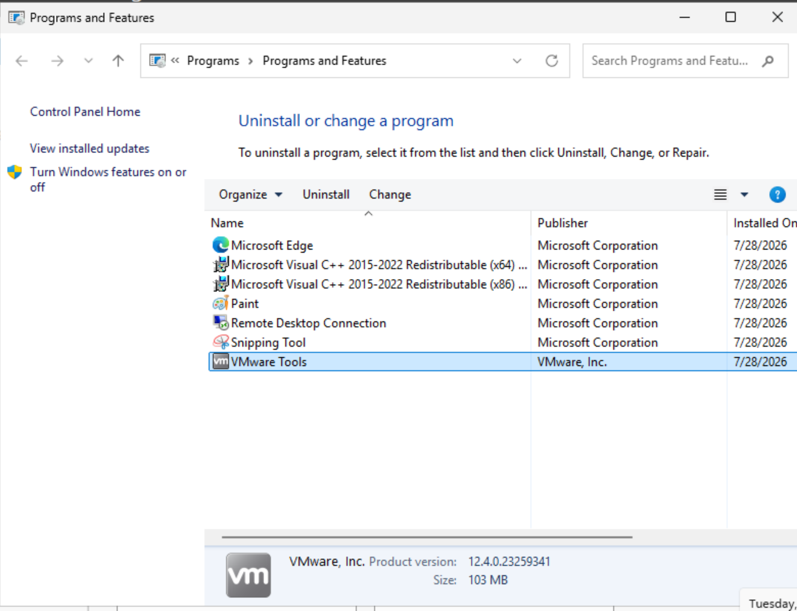

### VMware Tools Installation Complete

**Explanation**

VMware Tools was successfully installed using the Typical installation option. This provides optimized virtual hardware drivers, improved display performance, seamless mouse integration, clipboard support, and time synchronization between the host and guest operating systems.
