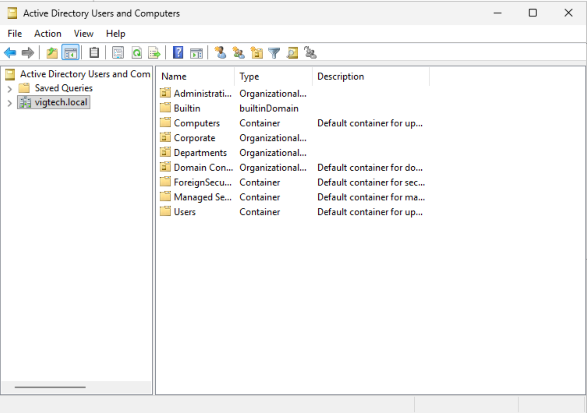
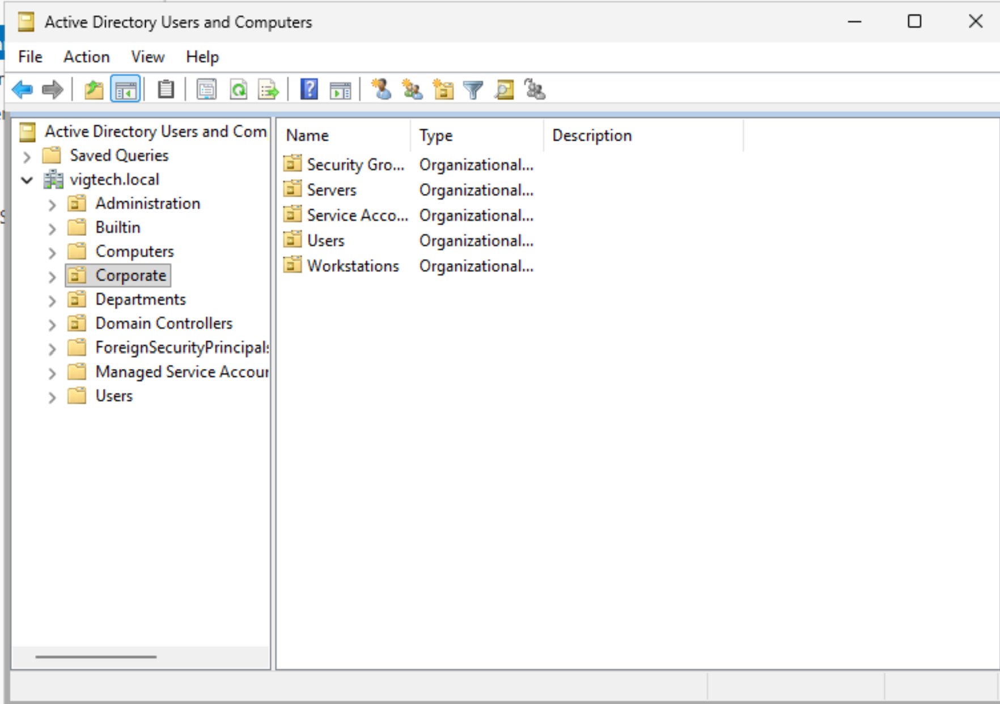
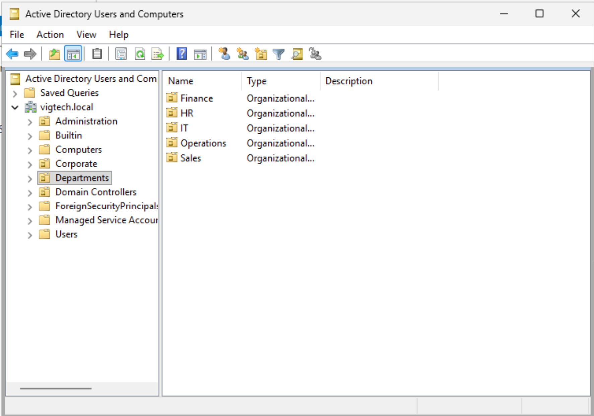

# Organizational Units (OUs)

## Objective

Design and implement a logical Organizational Unit (OU) structure for the Vig Tech Active Directory environment. The OU hierarchy provides a scalable foundation for managing users, computers, servers, service accounts, and Group Policy Objects (GPOs).

---

## Business Justification

Organizational Units allow administrators to logically organize Active Directory objects while simplifying administration. OUs provide a mechanism for applying Group Policies, delegating administrative permissions, and separating business departments from technical resources. A well-designed OU structure improves scalability, security, and long-term maintainability.

---

## Environment

| Component | Value |
|-----------|-------|
| Domain | vigtech.local |
| Domain Controller | DC01 |
| Active Directory | Windows Server 2025 |
| Administrative Tool | Active Directory Users and Computers |

---

## OU Design

Three top-level Organizational Units were created beneath the **vigtech.local** domain.

- Administration
- Corporate
- Departments

The **Corporate** OU contains technical resources managed by IT:

- Users
- Workstations
- Servers
- Security Groups
- Service Accounts

The **Departments** OU contains business units:

- IT
- HR
- Finance
- Sales
- Operations

Each department contains a dedicated **Users** OU to organize employee accounts.

---

## Implementation

1. Open **Active Directory Users and Computers**.
2. Create the three top-level Organizational Units.
3. Create the technical Organizational Units beneath **Corporate**.
4. Create department Organizational Units beneath **Departments**.
5. Create a **Users** Organizational Unit beneath each department.

---

## Validation

The Organizational Unit hierarchy was verified within Active Directory Users and Computers.

Validation confirmed:

- Three top-level Organizational Units were created.
- Corporate resources were separated from business departments.
- Departmental Users OUs were successfully created.

---

## Screenshots

### Top-Level Organizational Units

---

### Corporate OU Structure

---

### Department OU Structure

---

## Enterprise Importance

A well-designed OU structure simplifies administration, enables Group Policy deployment, and supports delegated administration. Separating technical resources from business departments follows common enterprise Active Directory design practices and provides a scalable foundation for future growth.