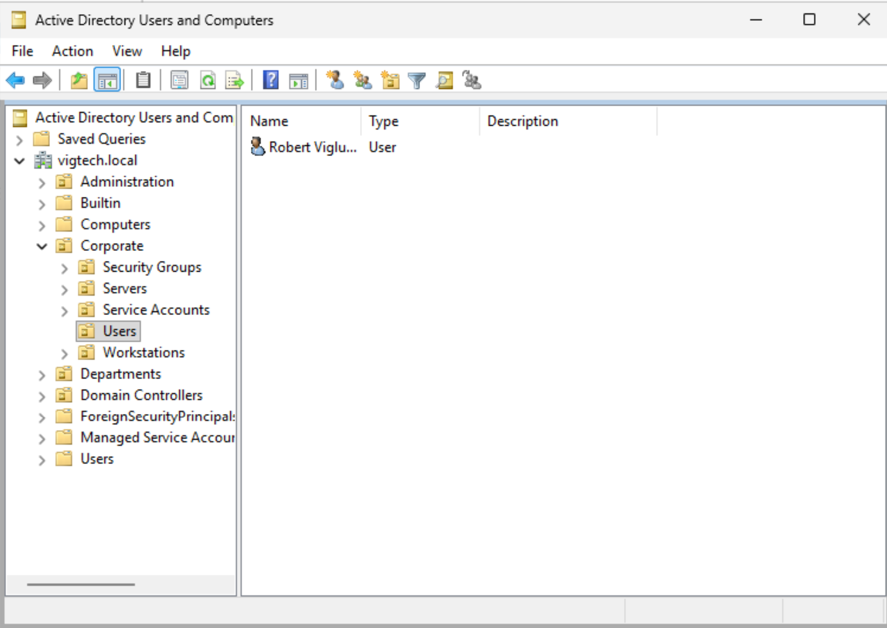
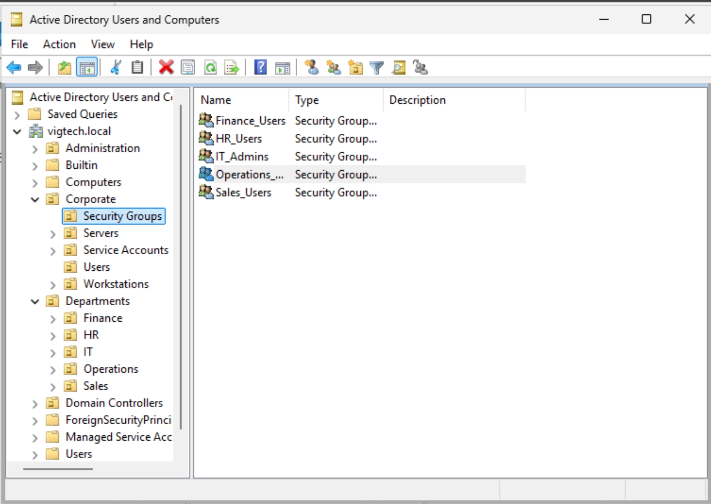
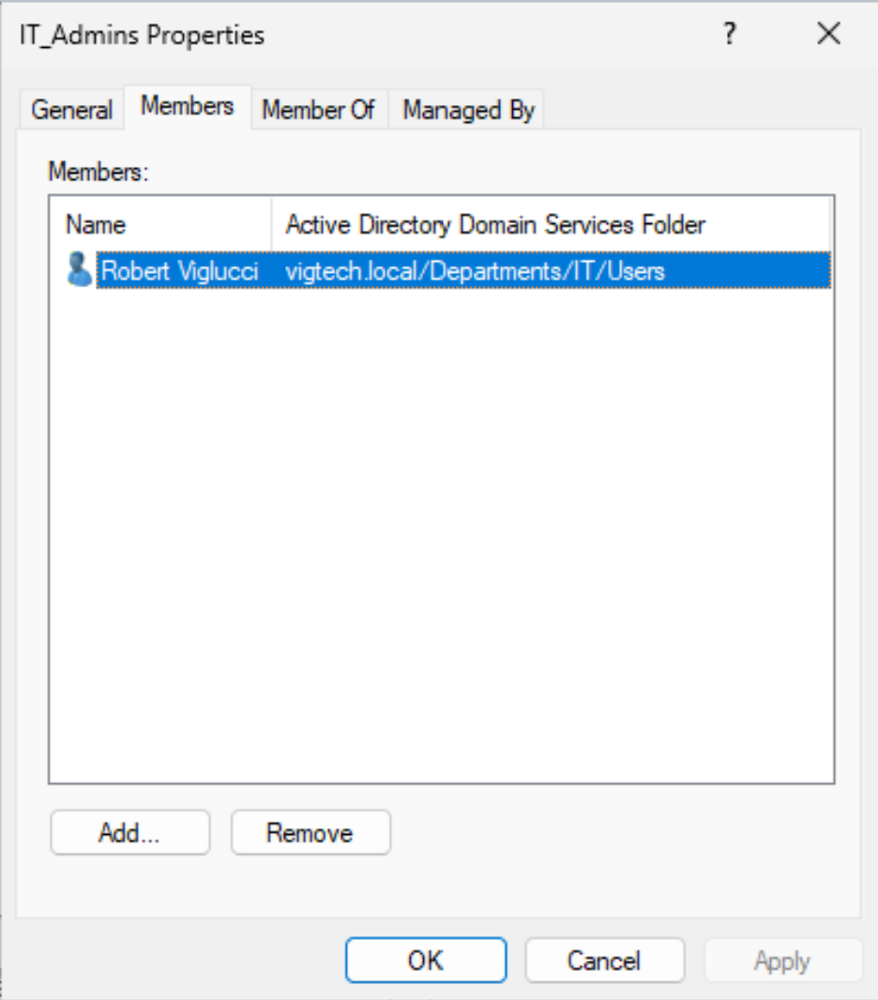

# Users and Security Groups

## Objective

Create enterprise user accounts and security groups within Active Directory and implement group-based access management following industry best practices.

---

## Business Justification

Rather than assigning permissions directly to individual users, enterprise environments use security groups to simplify administration and improve security. Users inherit permissions through group membership, reducing administrative overhead and making access management significantly easier.

---

## Environment

| Component | Value |
|-----------|-------|
| Domain | vigtech.local |
| Domain Controller | DC01 |
| Administrative Tool | Active Directory Users and Computers |

---

## Security Groups

The following Global Security Groups were created:

| Security Group | Purpose |
|----------------|---------|
| IT_Admins | IT administrative personnel |
| HR_Users | Human Resources employees |
| Finance_Users | Finance department employees |
| Sales_Users | Sales department employees |
| Operations_Users | Operations department employees |

---

## User Accounts

The following employee accounts were created:

| Name | Username | Department |
|------|----------|------------|
| Robert Viglucci | rviglucci | IT |
| Jane Smith | jsmith | HR |
| Emily Davis | edavis | Finance |
| John Carter | jcarter | Sales |
| Michael Brown | mbrown | Operations |

---

## Group Membership

Each user was assigned to the appropriate Global Security Group.

This follows the principle:

```
Users
    ↓
Security Groups
    ↓
Permissions
```

This approach improves scalability, simplifies permission management, and aligns with Microsoft Active Directory best practices.

---

## Validation

Validation confirmed:

- All users were successfully created.
- Departmental users were placed in the correct Organizational Units.
- Security groups were successfully created.
- Users were successfully added to their respective security groups.

---

## Screenshots

### Department Users



---

### Security Groups



---

### Security Group Membership



---

## Enterprise Importance

Security groups provide centralized permission management and simplify administration. Assigning permissions to groups rather than individual users reduces administrative complexity, supports role-based access control (RBAC), and improves security auditing across the enterprise.