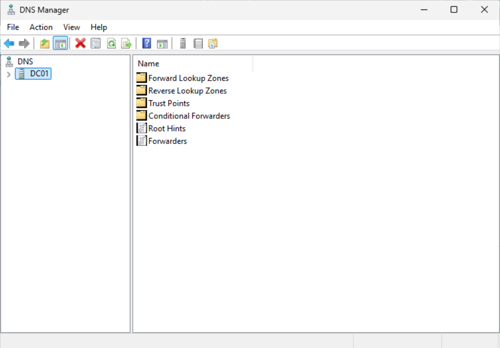
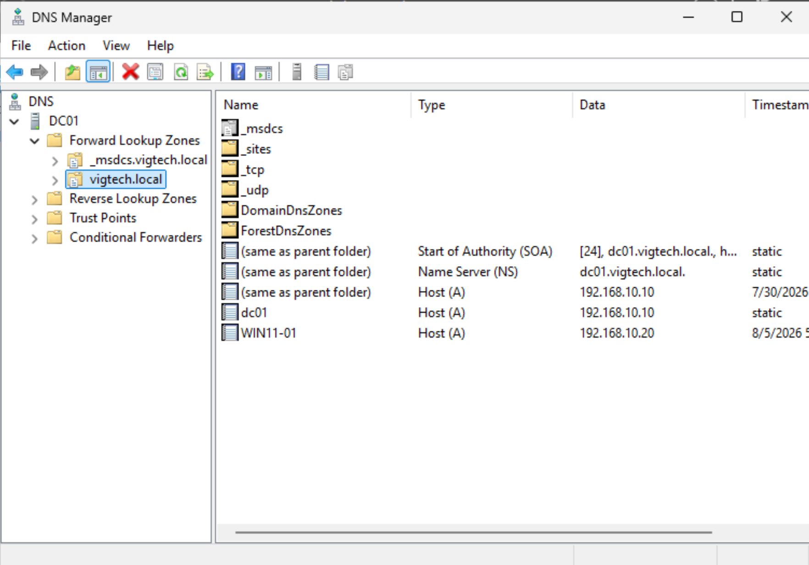
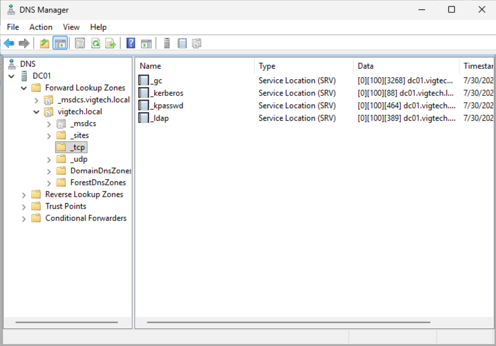
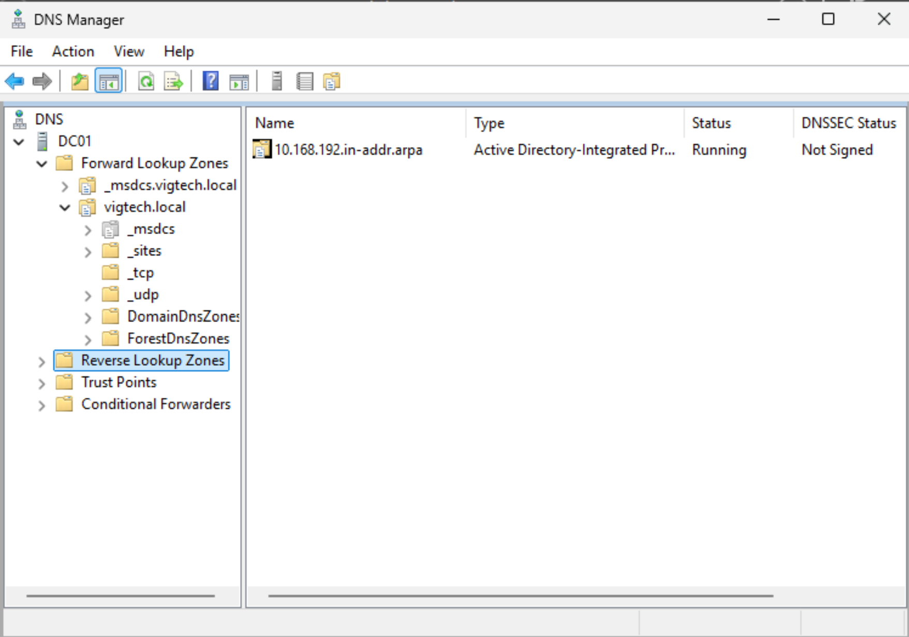
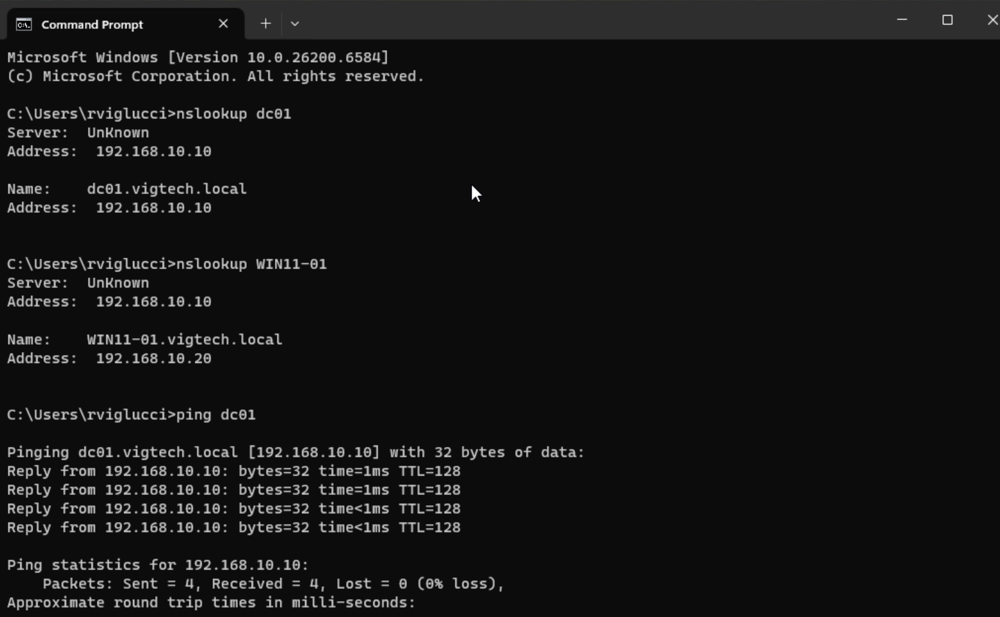

# DNS Configuration

## Objective

Document and validate the Domain Name System (DNS) infrastructure automatically deployed with Active Directory Domain Services (AD DS). Verify that DNS is correctly resolving domain resources and configure a reverse lookup zone to support reverse name resolution.

---

## Business Justification

DNS is one of the most critical services in an Active Directory environment. Every authentication request, Group Policy update, and domain join relies on DNS to locate domain controllers and Active Directory services. A properly configured DNS infrastructure enables reliable name resolution, service discovery, and centralized management across the enterprise network.

---

## Environment

| Component | Value |
|----------|-------|
| DNS Server | DC01 |
| Domain | vigtech.local |
| Server IP | 192.168.10.10 |
| Client | WIN11-01 |
| Client IP | 192.168.10.20 |
| DNS Zone Type | Active Directory Integrated |

---

## Configuration Summary

The following tasks were completed:

1. Opened DNS Manager on DC01.
2. Verified the Active Directory-integrated Forward Lookup Zone.
3. Confirmed Host (A) records for both DC01 and WIN11-01.
4. Reviewed automatically generated Service Locator (SRV) records used by Active Directory.
5. Created an IPv4 Reverse Lookup Zone for the 192.168.10.0/24 network.
6. Verified successful DNS name resolution from the Windows 11 workstation using `nslookup` and `ping`.

---

## Forward Lookup Zone

The **Forward Lookup Zone** translates hostnames into IP addresses.

The `vigtech.local` zone was automatically created during the Active Directory Domain Services installation and promotion of DC01 to a Domain Controller.

The zone contains:

- Start of Authority (SOA) record
- Name Server (NS) record
- Host (A) record for **DC01**
- Host (A) record for **WIN11-01**
- Active Directory service records

These records allow domain clients to locate resources using fully qualified domain names instead of IP addresses.

---

## Service Locator (SRV) Records

Active Directory automatically creates SRV records that allow domain clients to discover network services.

Examples include:

- LDAP
- Kerberos
- Global Catalog
- Domain Controller services

Rather than searching for a specific server by name, Windows clients query DNS for the required service, and DNS returns the appropriate Domain Controller.

---

## Reverse Lookup Zone

An IPv4 Reverse Lookup Zone was created for the:

192.168.10.0/24

network.

Reverse lookup zones allow administrators and applications to resolve IP addresses back to hostnames using Pointer (PTR) records.

Although not strictly required for Active Directory functionality, reverse lookup zones are considered a best practice in enterprise Windows environments and simplify network troubleshooting.

---

## Validation

DNS functionality was validated by:

- Resolving the DC01 hostname using `nslookup`
- Resolving the WIN11-01 hostname using `nslookup`
- Successfully communicating with DC01 using `ping`
- Confirming that Active Directory records were present within the Forward Lookup Zone

Successful validation confirmed that Windows clients can locate domain resources using DNS.

---

## Screenshots

### DNS Manager

---

### Forward Lookup Zone

---

### Active Directory SRV Records

---

### Reverse Lookup Zone

---

### DNS Validation

---

## Lessons Learned

This exercise demonstrated that Active Directory is tightly integrated with DNS. Domain joins, authentication, and future Group Policy processing all depend on DNS successfully locating domain controllers and associated services. Creating a reverse lookup zone further improves network administration and troubleshooting by enabling reverse name resolution, which is commonly implemented in enterprise environments.

---

## Next Steps

The next phase of the project is to deploy and configure the Windows Server DHCP role. The DHCP server will provide centralized IP address management, assign DNS server settings to domain clients, and replace VMware's built-in DHCP service to better simulate an enterprise network.
