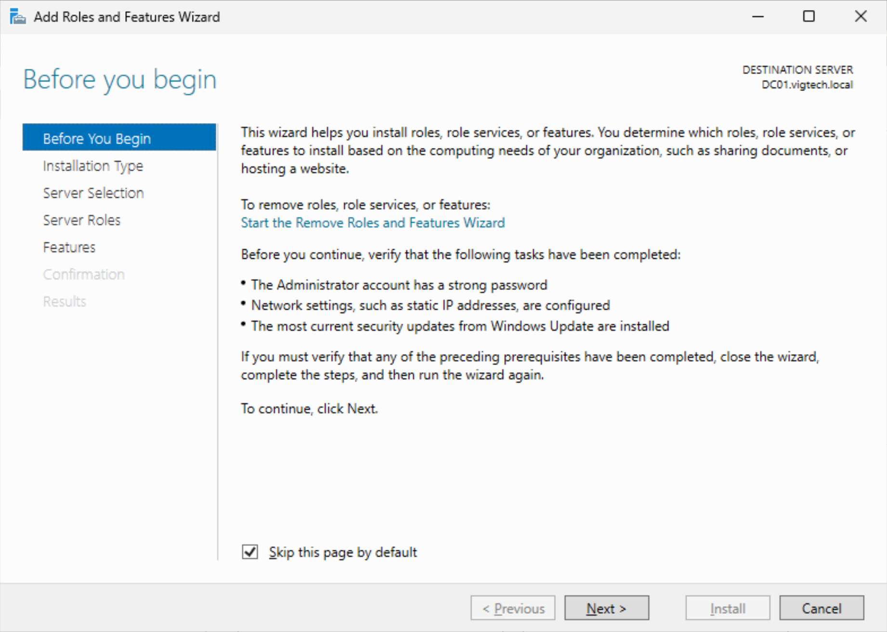
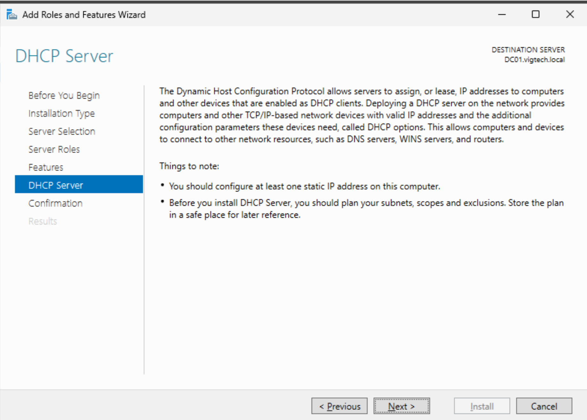
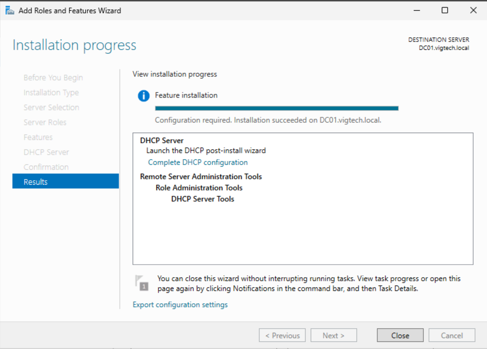
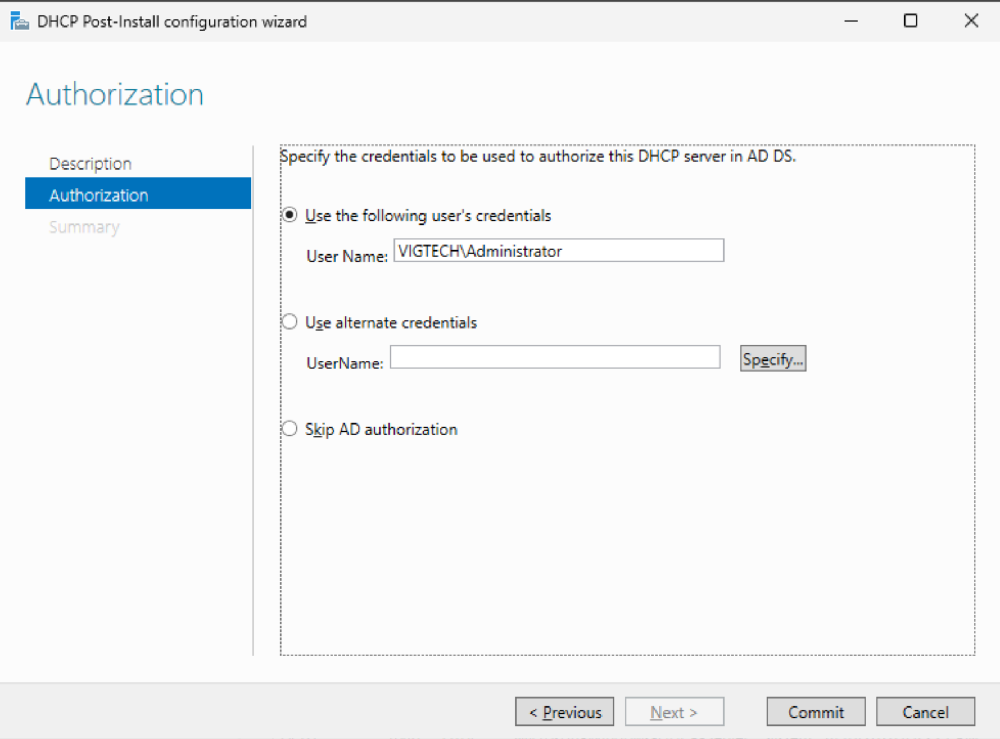
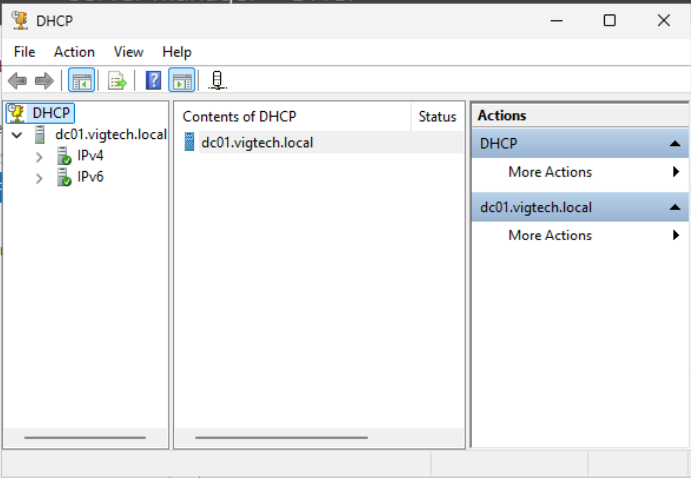
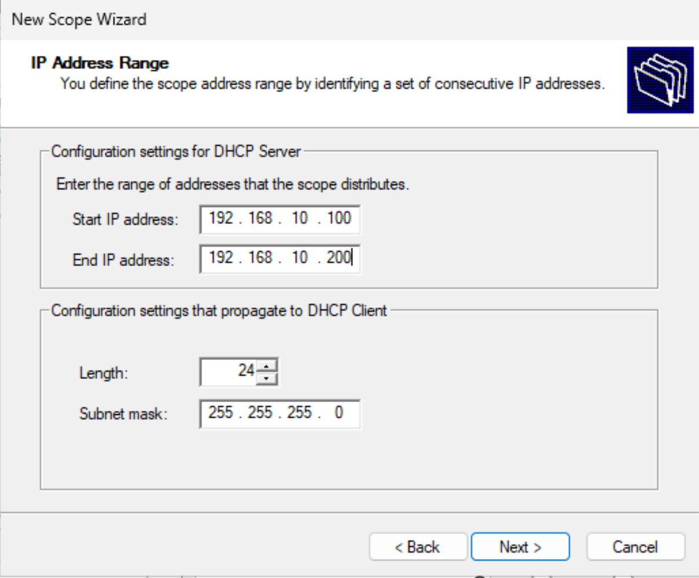
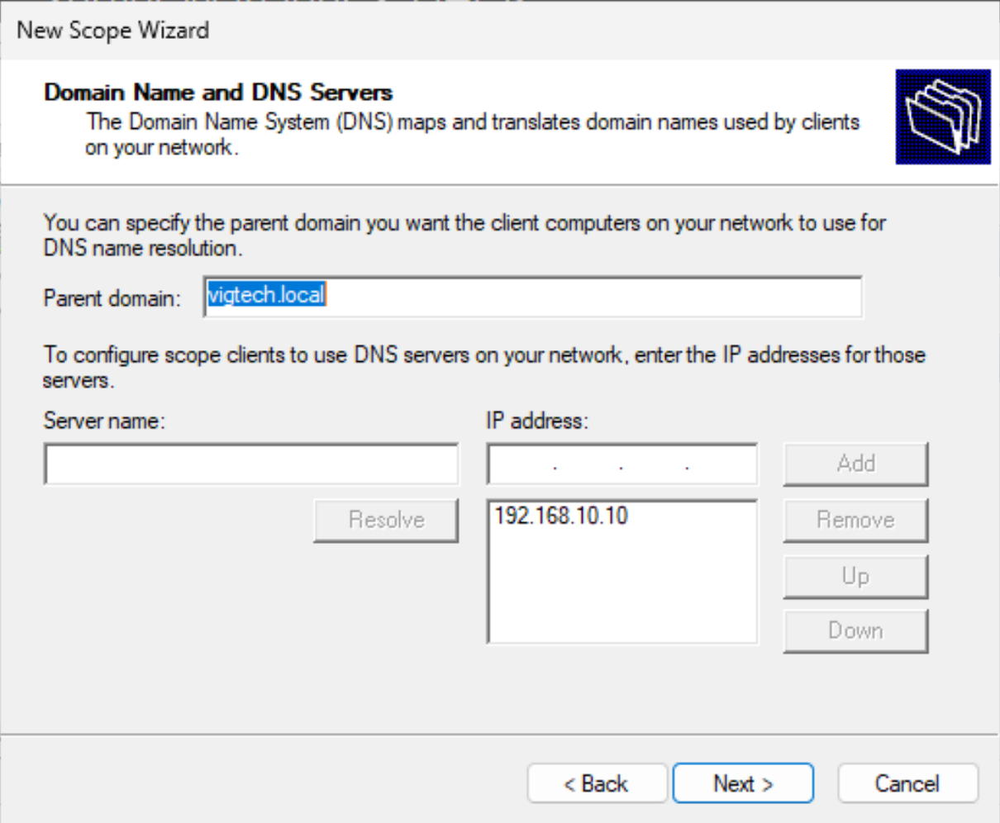
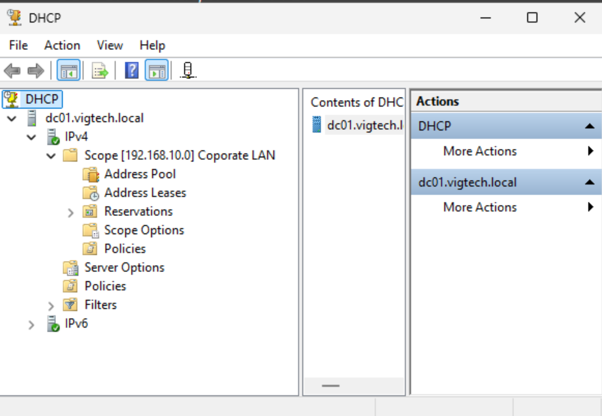
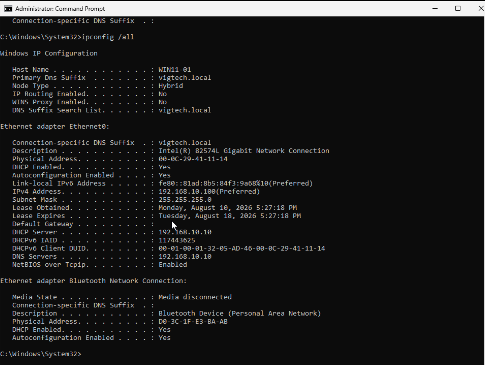
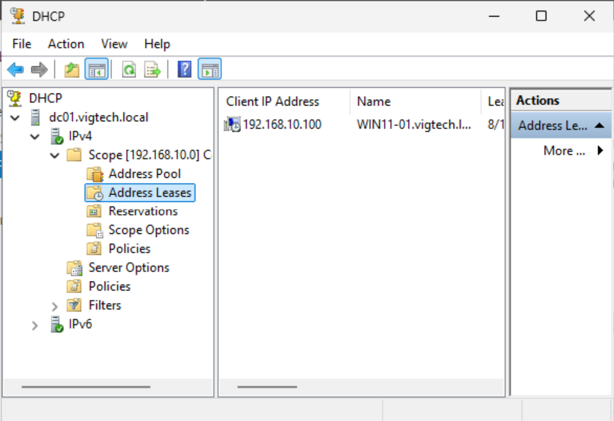

# Dynamic Host Configuration Protocol (DHCP)

## Objective

Deploy and configure the Dynamic Host Configuration Protocol (DHCP) Server role on the Windows Server 2025 Domain Controller. The DHCP service will automatically assign IPv4 addresses and DNS settings to domain-joined clients, eliminating manual network configuration while integrating with Active Directory and DNS.

---

# Environment

| Component | Value |
|-----------|-------|
| Domain Controller | DC01 |
| Client Workstation | WIN11-01 |
| Domain | vigtech.local |
| Server IP Address | 192.168.10.10 |
| DHCP Scope | Corporate LAN |
| Address Pool | 192.168.10.100 – 192.168.10.200 |
| Subnet Mask | 255.255.255.0 |

---

# Installing the DHCP Server Role

The DHCP Server role was installed through **Server Manager** using the **Add Roles and Features Wizard**. After installation, the server was authorized within Active Directory, allowing it to lease IP addresses to clients on the domain network.

## Add Roles Wizard

## DHCP Role Selection

## Installation Complete

## DHCP Authorization

## DHCP Manager

---

# Creating the DHCP Scope

A new IPv4 scope named **Corporate LAN** was created to automatically distribute IP addresses to client systems.

| Setting | Value |
|---------|-------|
| Scope Name | Corporate LAN |
| Start Address | 192.168.10.100 |
| End Address | 192.168.10.200 |
| Lease Duration | 8 Days |
| Default Gateway | None (Host-Only VMware Lab) |
| Preferred DNS Server | 192.168.10.10 |
| DNS Domain | vigtech.local |

## DHCP Scope Creation

---

# Configuring DHCP Options

The scope was configured to automatically distribute DNS settings to client devices. Clients receive the domain DNS server (DC01) along with the Active Directory domain suffix, allowing seamless authentication and name resolution.

## DHCP Scope Options

---

# Activating the Scope

After configuration, the scope was activated and made available for client devices requesting network configuration.

## Active DHCP Scope

---

# Client Validation

The Windows 11 workstation (**WIN11-01**) was reconfigured to obtain both its IP address and DNS settings automatically.

After renewing its network configuration, the workstation successfully received:

- IPv4 Address: **192.168.10.100**
- DHCP Server: **192.168.10.10**
- DNS Server: **192.168.10.10**
- DNS Suffix: **vigtech.local**

This confirms that the DHCP server is correctly leasing addresses and providing the required network configuration for domain clients.

## DHCP Client Lease

---

# Lease Verification

The DHCP Manager console confirms that WIN11-01 successfully received a lease from the configured DHCP scope.

## Address Leases

---

# Enterprise Relevance

DHCP is a core enterprise infrastructure service that centralizes IP address management and significantly reduces manual administration. By integrating DHCP with Active Directory and DNS, client systems automatically receive the correct IP configuration required for authentication, domain communication, and resource discovery. This approach improves scalability, reduces configuration errors, and simplifies network management across large environments.

---

# Skills Demonstrated

- Windows Server Administration
- DHCP Server Deployment
- DHCP Scope Configuration
- Active Directory Integration
- DNS Integration
- Enterprise Network Services
- Windows 11 Administration
- Client Network Validation
- Dynamic IP Address Management
- Infrastructure Troubleshooting

---

# Outcome

A fully functional DHCP infrastructure was successfully deployed and integrated with Active Directory and DNS. Domain-joined Windows clients now automatically receive valid IP addressing information and DNS configuration from the Windows Server 2025 Domain Controller, completing another critical enterprise infrastructure service within the lab.
