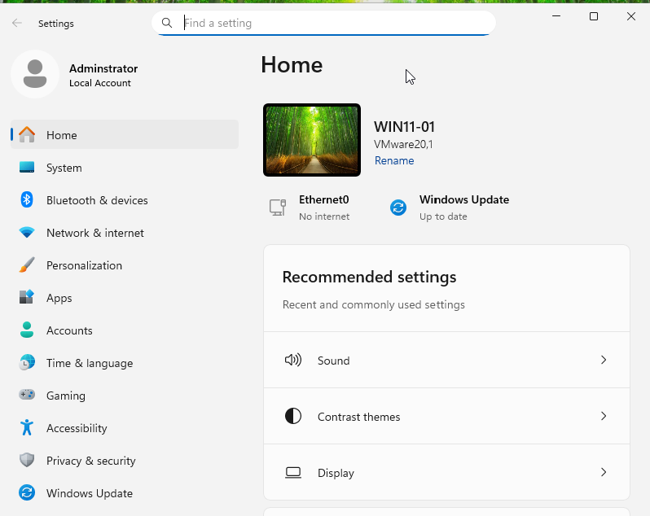
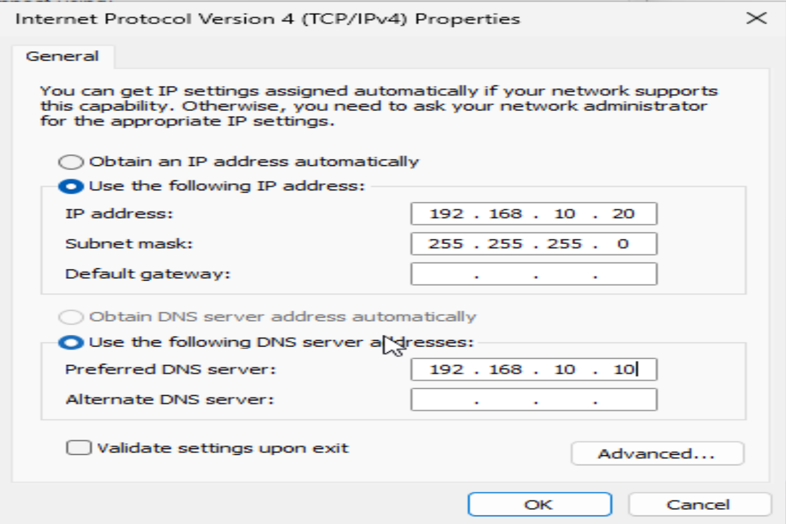
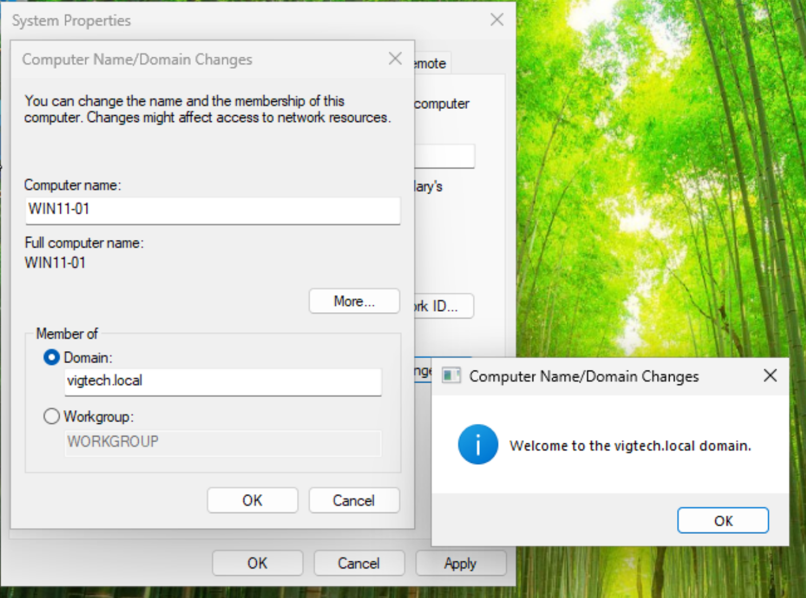
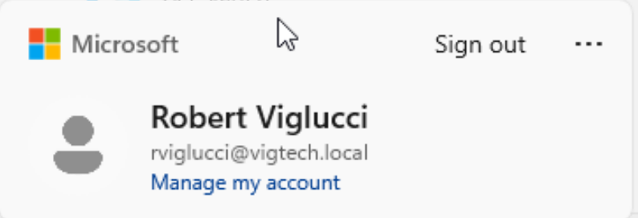

# Windows 11 Domain Join

## Objective

Deploy a Windows 11 Enterprise virtual machine, configure network settings, and successfully join the workstation to the **vigtech.local** Active Directory domain. This workstation will serve as the primary domain-joined client for validating Active Directory services, authentication, and future Group Policy deployments.

---

## Business Justification

Joining workstations to an Active Directory domain enables centralized authentication, security policy enforcement, software deployment, and resource management. Rather than managing each workstation individually, administrators can manage users and computers from a central Domain Controller, improving security, scalability, and operational efficiency.

---

## Environment

| Component | Value |
|-----------|-------|
| Operating System | Windows 11 Enterprise |
| Computer Name | WIN11-01 |
| Domain | vigtech.local |
| Domain Controller | DC01 |
| Domain Controller IP | 192.168.10.10 |
| Workstation IP | 192.168.10.20 |
| Hypervisor | VMware Workstation Pro |

---

## Configuration Summary

The following tasks were completed:

1. Installed Windows 11 Enterprise in VMware Workstation Pro.
2. Renamed the workstation to **WIN11-01**.
3. Configured a static IPv4 address.
4. Configured the workstation to use **DC01 (192.168.10.10)** as its preferred DNS server.
5. Verified connectivity to the Domain Controller using **ping**.
6. Verified DNS name resolution using **nslookup**.
7. Joined the workstation to the **vigtech.local** Active Directory domain.
8. Restarted the workstation.
9. Successfully authenticated using a domain user account.

---

## Network Configuration

| Setting | Value |
|---------|-------|
| IP Address | 192.168.10.20 |
| Subnet Mask | 255.255.255.0 |
| Default Gateway | None (Host-Only Network) |
| Preferred DNS | 192.168.10.10 |

---

## Validation

The deployment was validated by confirming:

- Successful communication with DC01.
- Successful DNS resolution for **vigtech.local**.
- Successful Active Directory domain join.
- Successful login using the **rviglucci** domain account.
- Automatic creation of a domain user profile.

---

## Screenshots

### Rename Computer

---

### Static IP Configuration

---

### Domain Join Successful

---

### Domain User Login

---

## Lessons Learned

A successful Active Directory domain join depends on proper network configuration, particularly DNS. The workstation must use the Domain Controller as its preferred DNS server in order to locate Active Directory services. Once joined to the domain, centralized authentication allows users to log in using domain credentials, laying the foundation for future Group Policy management and enterprise administration.

---

## Next Steps

The Windows 11 workstation will be used to validate additional enterprise services, including:

- DNS Management
- DHCP Configuration
- Group Policy deployment
- Security policy enforcement
- PowerShell administration
- Enterprise validation and testing